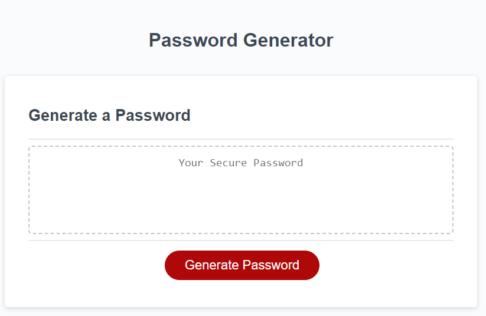
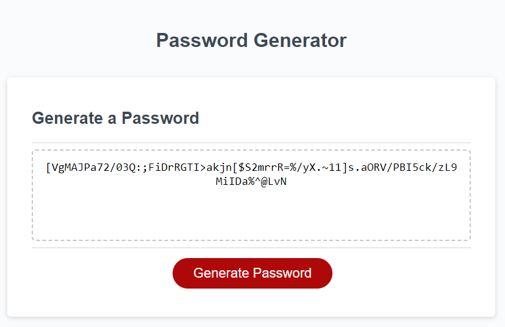

# Password Generator

## Program Description

This program creates a randomly generated password based on criteria selected. When the user opens the page, a prompt asks to select a length between (and not including) 8 and 128. Then, the webpage asks the user if they want lowercase letters, uppercase letters, numbers, and/or special characters in their password. The user can select any combination of the criteria and the program will oblige. Once all prompts have been answered, a randomly generated password following the selected criteria appears inside the center box.

## Screenshots

The following image shows the webpage on landing

The following image shows the webpage after entering 75 for password length, and selecting yes for all criteria

## Link to Deployed Application

